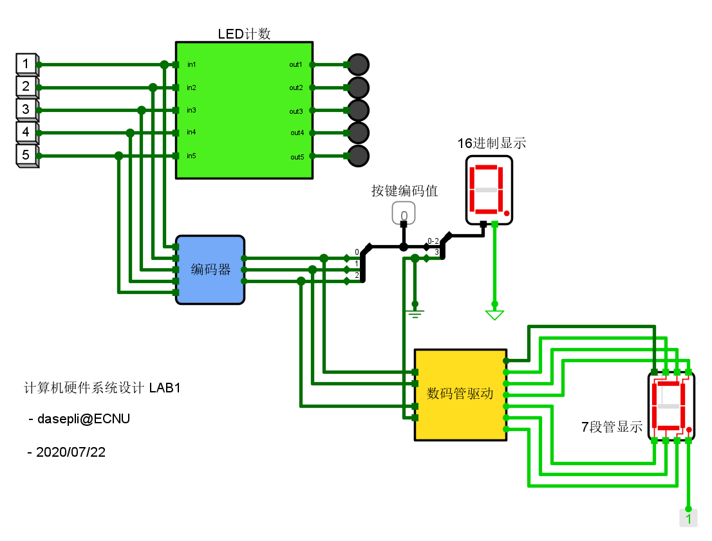

# From Nand To Tetris
**This is Peng's repo for computer organization, from nand to tetris, learn by playing!**
> SATRT ON 2020.07.21

- [Course Homepage](http://www.icourse163.org/learn/HUST-1205809816?tid=1450219449#/learn/announce)
- [EduCoder Link](https://www.educoder.net/paths/1426)

## Notes

|No. |Note |Materials | 
| :--: | :--: | :--: |
| Lec1 | [Introduction](notes/chap1_intro.html) | |
| Lec2 | [Arithmetic&Logical Unit](notes/chap2_ALU.html) | |
| Lec3 | [Memory](notes/chap3_memory.html) | | 
| Lec4 | [Instruction](notes/chap4_instruction.html) | |
| Lec5 | [Control Unit](notes/chap5_CU.html) | |
| Lec6 | [Bus](notes/chap6_bus.html) | |
| Lec7 | [Input&Output](notes/chap7_IO.html) | |

## Projects
- [Lab 1：Logisim Introduction](https://github.com/dasepli/Nand2Tetris/tree/master/HUST_Computer_Hardware_System_Design/lab1_logisim_intro)

## References
- [华中科技大学：计算机组成原理](https://www.icourse163.org/learn/HUST-1003159001?tid=1003367001#/learn/content)
- [国科大课程：从门电路到有限自动机](https://vlab.ustc.edu.cn/guide/index.html)
- [Youtube Course](https://www.youtube.com/watch?v=hi5ekb_9ZSU&list=PLbx-k3N9Yr9-vSAQ4QBzI981sU_xc_zWM)
- [知乎回答](https://www.zhihu.com/question/38838088/answer/78521124)
- [Songkeys' Blog](https://songkeys.github.io/posts/nand2tetris/)
- [使用logisim设计简易CPU](https://blog.csdn.net/qq_37937830/article/details/93144805)
- [Logisim设计模型机——编制并执行程序](https://blog.csdn.net/qq_41420747/article/details/91444626?ops_request_misc=%257B%2522request%255Fid%2522%253A%2522158436643019724846401669%2522%252C%2522scm%2522%253A%252220140713.130056874..%2522%257D&request_id=158436643019724846401669&biz_id=0&utm_source=distribute.pc_search_result.none-task)
- [简单CPU设计实践](https://lianera.github.io/post/2014/cpu-step-by-step/)
- [Nand2Teris @ Hebrew University](https://www.nand2tetris.org/)
