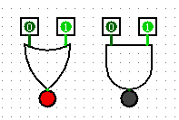

# Welcome! This is Peng's Repo for Computer Organization!

## Notes
- TBC

## Projects
### Nand2Teris @ The Hebrew University of Jerusalem
- [Course Homepage](https://www.nand2tetris.org/)

### Computer Hardware System Design @ Huazhong University of Science and Technology
- [Homepage](http://www.icourse163.org/learn/HUST-1205809816?tid=1450219449#/learn/announce)
- Lab 1：Logisim Introduction

## References
- [华中科技大学：计算机组成原理](https://www.icourse163.org/learn/HUST-1003159001?tid=1003367001#/learn/content)
- [国科大课程：从门电路到有限自动机](https://vlab.ustc.edu.cn/guide/index.html)
- [Youtube Course](https://www.youtube.com/watch?v=hi5ekb_9ZSU&list=PLbx-k3N9Yr9-vSAQ4QBzI981sU_xc_zWM)
- [知乎回答](https://www.zhihu.com/question/38838088/answer/78521124)
- [Songkeys' Blog](https://songkeys.github.io/posts/nand2tetris/)
